# SpaceSage — app guide

Screen by screen, what you see and what every control does. Every screenshot on
this page is a real render of the app: they are produced by the GUI suite
(`tests/gui/test_screenshots.py`, `tests/gui/test_ai_screenshots.py`) and land in
[`artifacts/gui/`](../artifacts/gui). If a screen changes, its picture changes
with it.

New here? [quickstart.md](quickstart.md) gets you from a WizTree export to a
finished run in five minutes. This page is the reference.

One thing is true of every screen below, and the app says it in the rail footer
on all of them: **analysis is read-only, and SpaceSage only acts on a plan you
approve.** See [safety.md](safety.md) for the exact contract.

---

## The shell

One window, four pages on the left rail, one status bar at the bottom.

- **Rail** — `Import`, `Opportunities`, `Plan`, `Settings`, plus the standing
  note *"Analysis is read-only. SpaceSage only acts on a plan you approve."*
- **Keyboard** — `Ctrl+1`…`Ctrl+4` switch pages, `Ctrl+F` jumps to the search
  box, `Space` toggles the row under the cursor in any of the three lists, and
  the plan screen has `Ctrl+D` for the dry run and `Ctrl+Return` to execute.
- **Status bar** — the left cell reports what is happening (rows read per
  second, "Analyzing…", the outcome of a run). The right cell carries the theme
  the app is following and one line about the AI layer: `AI off`,
  `AI not ready: …`, or the provider and model with the session's token count
  and estimated cost.
- **Theme** — light and dark are the same token set with different values, and
  the app follows the operating system until you choose otherwise in Settings.
  There is a dark render at the end of the Opportunities section.

---

## 1. Import

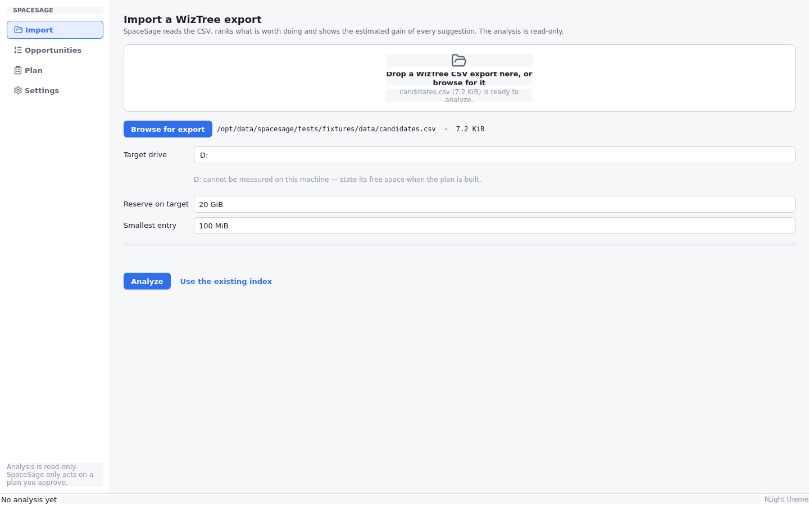

WizTree tells you what is big; this screen is where that export becomes an
index. Drop the CSV on the zone (or *Browse for export*), set the three
parameters, press **Analyze**.

- **The export** — a WizTree CSV, UTF-8 or UTF-16, with or without a BOM. The
  seven-column export is the contract (`File Name, Size, Allocated, Modified,
  Attributes, Files, Folders`); columns are matched by name, so extra columns
  are ignored and a missing optional column is fine. A file that is not a
  WizTree export fails with a readable reason instead of a half-built index.
- **Target drive** — where planned moves go. Helper text tells you whether the
  app can measure that drive's free space on this machine; if it cannot (a drive
  that is not attached, or an export from another machine), you state its free
  space when the plan is built.
- **Reserve on target** — free space the planner must leave untouched
  (default 20 GiB). Moves are budgeted against `free − reserve`, so a plan can
  never fill the drive it is moving to.
- **Smallest entry** — the size floor for the list (default 100 MiB). Lower it
  to see more; every row below the floor is simply not listed, nothing is
  hidden that would otherwise be acted on.
- **Analyze** runs on a worker thread: the window stays responsive and the
  status bar counts rows per second while it reads. **Use the existing index**
  skips the import entirely when you already analyzed this export.

Re-importing **replaces** the index — a fresh export, a fresh start. Nothing on
disk is touched by an import or by the analysis that follows it.

---

## 2. Opportunities — the core screen

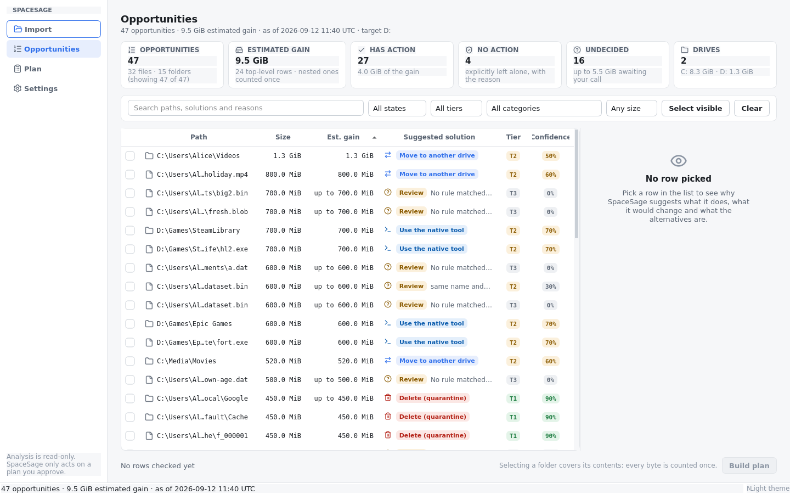

One ranked list of files *and* folders, biggest estimated win first. This is
where the work happens.

### The summary strip

Six cards, recomputed on every filter change:

| card | what it counts |
|---|---|
| **Opportunities** | rows listed, split into files and folders |
| **Estimated gain** | the sum the list claims, with nested rows counted once |
| **Has action** | rows the rules would act on, and the gain they carry |
| **No action** | rows deliberately left alone — a decision, with its reason |
| **Undecided** | rows no rule recognised, and the gain waiting on your call |
| **Drives** | the volumes the index spans, with their totals |

Totals count nested rows once: a folder row *covers* its contents, so checking it
takes its children with it and no byte is ever counted twice. The action bar
under the list always says the same thing: *"Selecting a folder covers its
contents; every byte is counted once."*

### Filters and selection

Search matches paths, solutions and reasons. Four dropdowns narrow by **state**
(has action / no action / undecided / checked), **tier**, **category** and
**size**. *Select visible* checks everything the filters currently show —
usually the fastest way to a first plan — and *Clear* unchecks.

### The rows

| column | what it means |
|---|---|
| **Path** | mono, ellipsized in the middle — the details pane has it in full |
| **Size** | what the entry occupies |
| **Est. gain** | what acting on it would free. *"up to N"* means the gain is an upper bound the app has not verified — weak duplicate clusters are the usual case |
| **Suggested solution** | the badge (Delete (quarantine) / Move to another drive / Compress / Use the native tool / Review / No action) plus a one-line why |
| **Tier** | the risk tier the rule assigned — see [safety.md](safety.md) |
| **Confidence** | how sure **the rules** are about this row |

A **"No action" row is never hidden**: an entry the rules deliberately leave
alone renders with its reason, because that is a decision, not a gap. If a rule
did not recognise an entry at all, it is *undecided* and carries no suggestion.

The Confidence column reports the rule's own confidence for every row. An AI
answer for the same row is a different claim, so it has its own chip with its own
number in the details pane — one column never means two things.

### The details pane

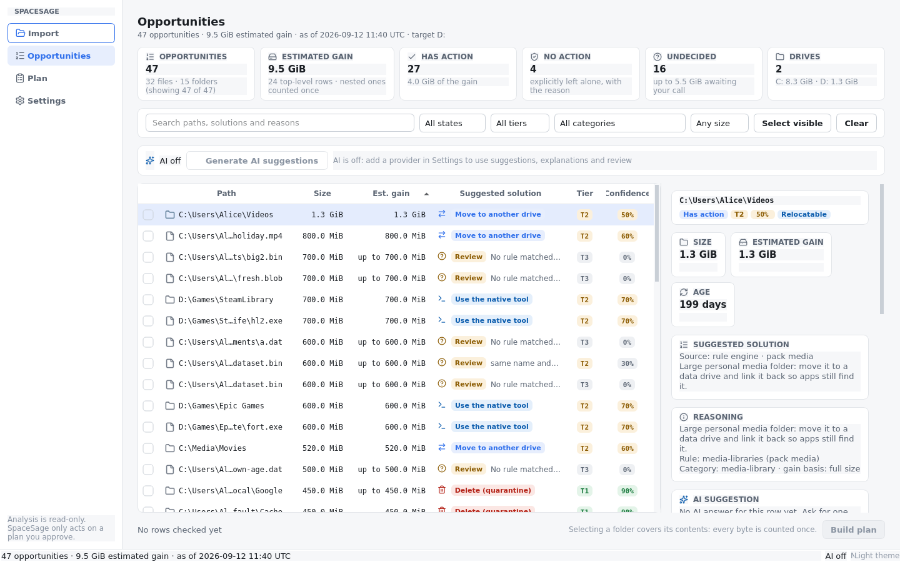

Pick a row and the pane explains it end to end:

- **Badges** — the state (*Has action* / *No action* / *Undecided*), the tier,
  the confidence, and any character badge the rules found (e.g. *Relocatable*).
- **Size / Estimated gain / Age** — the three numbers the rank was built from.
- **Suggested solution** — the source of the verdict (*Source: rule engine ·
  pack media*, or the AI's model name) and the plain-language rationale.
- **Reasoning** — the rule that decided (id and pack), the category, and the
  gain basis (`full size`, `verified duplicates`, …) so a rank can be
  re-derived by hand.
- **Side effects** and **Alternatives** when the engine has them.
- **Move destination** — the editor for where a move should land, pre-filled
  from the target drive and the planner's mirror layout.

### The dark theme

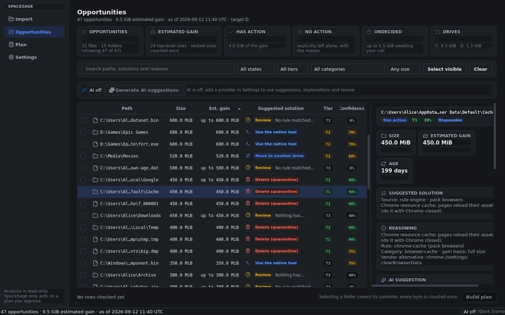

Both themes are one token set: spacing, typography, semantic colours, tier
badges and the mono stack for paths and sizes. A theme change restyles every
widget at once, and the renders above come from the same tests as the light ones.

---

## 3. The AI layer in the list (optional)

The AI layer is off until you add a provider, and it can **suggest, classify,
explain and review — never execute**. Nothing it writes becomes an action
without a human decision, and every AI answer goes through the same validation
pipeline as a rule. [ai.md](ai.md) covers the layer itself; this is its product
surface.

### Batch fill

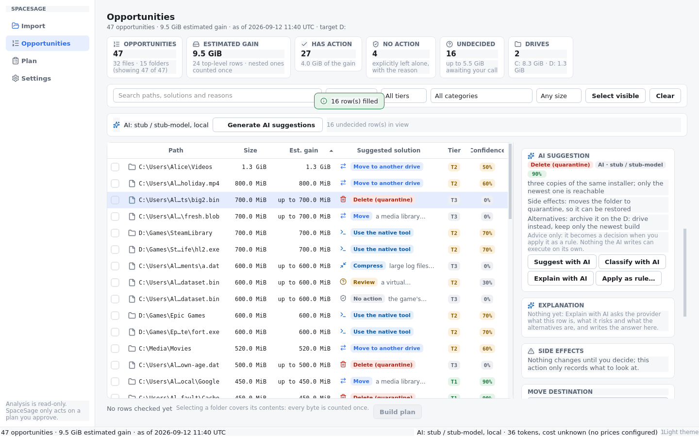

**Generate AI suggestions** in the bar above the table fills in the undecided
rows. It is never a surprise: the pre-flight dialog states how many rows are in
view, what the run would cost in calls, cache hits and tokens, and what will
leave the machine. Then:

- the fill runs in bounded background batches and the list repaints as each
  batch lands — you do not wait for the last row to see the first;
- rows answered before are served from the **cache** ("Everything in view was
  answered before: filling from the cache", zero calls);
- the Suggested-solution column carries its **provenance**: the rule that
  decided, or the AI verdict — and the details pane's AI card carries the chip
  (*AI · provider / model*) and the answer's own confidence;
- *No action* from the AI renders muted, as advice.

### Per-row questions

- **Suggest with AI** asks for a verdict on the row on screen.
- **Classify with AI** asks which category it belongs to.
- **Explain with AI** streams prose into the explanation card: what this is, what
  it risks, what the alternatives are.

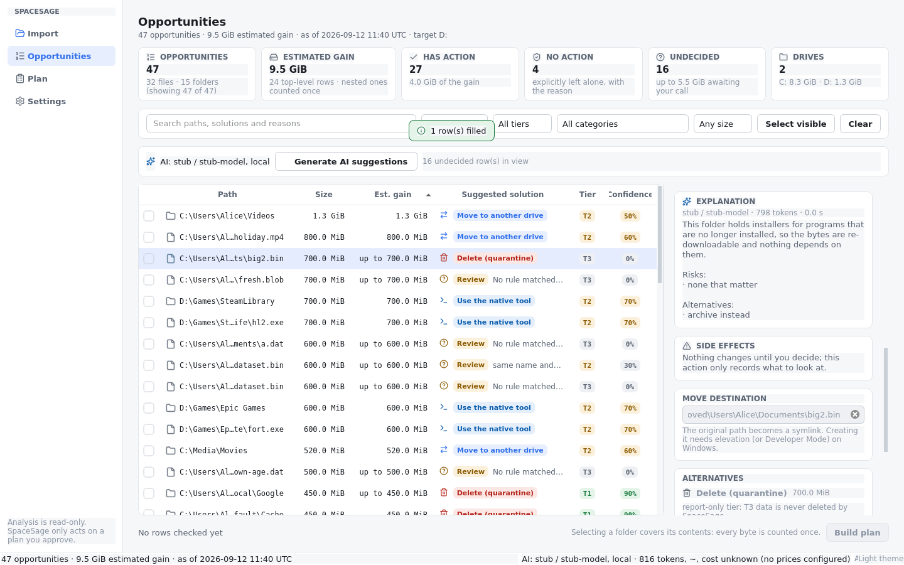

Failures are part of the surface, not a dialog you dismiss: a provider that is
unreachable, refuses or has no key paints a **coded error with its hint** inside
the AI card (`local_only`, `no_api_key`, `timeout`, …). The list, the plan and
your session survive it.

### Apply as rule — the only door to the engine

An AI answer can end up as a **rule**, which is a different thing from an action.
*Apply as rule…* renders the exact TOML the engine would load, dry-runs it,
shows it to you, and writes it **only after you confirm** — into your user rule
directory, where it is shadowed by id like any hand-written pack. The listing is
re-ranked immediately so those items match from the built-in engine from then on.
Tiers the executor may not touch are refused with the engine's own sentence.

### Reviewing a plan

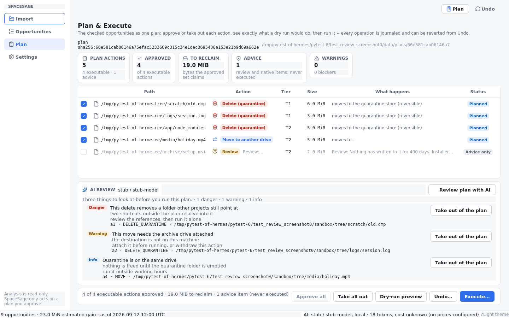

**Review plan with AI** on the Plan screen sends a reduced document (action id,
type, path, destination, size, tier, why) and gets back severity-tagged
annotations attached to the plan's own action ids, plus a one-line summary. Each
annotation offers the matching decision — *Take out of the plan* for an action
that is in it, *Approve it* for one that is not. A review can never approve
anything and can never add an action: **the plan's action list is only ever
written by the rule engine.**

### Providers

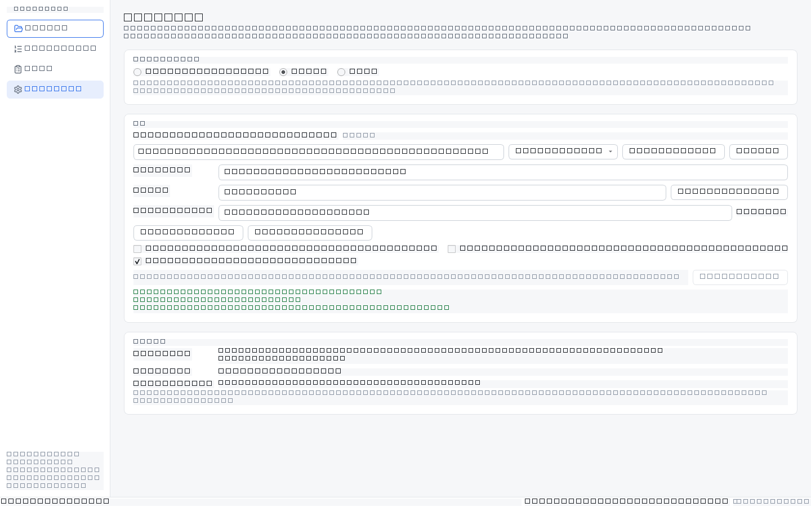

Settings owns the provider list (add / edit / remove, presets for Ollama, LM
Studio, OpenAI, OpenRouter and any custom OpenAI-compatible endpoint), *Test
connection* (the models the endpoint offers, the models it actually calls, the
latency), the default provider, and the three switches that decide what leaves
the machine: `redact_paths`, local-only and streaming.

---

## 4. Plan & Execute

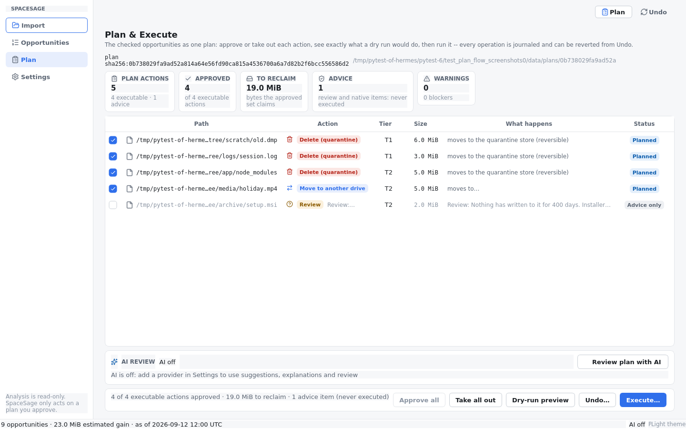

The checked rows become one plan. The header shows the plan's own identity —
`plan sha256:…` and the workspace folder it lives in — so what you approve is
the exact document you reviewed, not "some plan".

- **Summary cards** — plan actions (executable vs advice), how many are
  approved, the bytes the approved set claims, the advice count and the
  **warnings** count with its blockers.
- **The table** — path, action, tier, size, *what happens* and status. Advice
  rows (`Review`, `Native`) are listed, exact, and **unapprovable**: they show
  what the engine wants a human to look at, and the executor will never run
  them.
- **Approval checkboxes** — each click rewrites `approved.json` for *this*
  plan's `plan_id` (`<data dir>/plans/<token>/`), so the approval on disk is
  always what you last decided. *Approve all* / *Take all out* do it in one
  go.
- **Warnings** — anything the planner wants you to know before running
  (destination drives that cannot be measured, actions needing elevation, …).

### Dry run: exactly what would happen

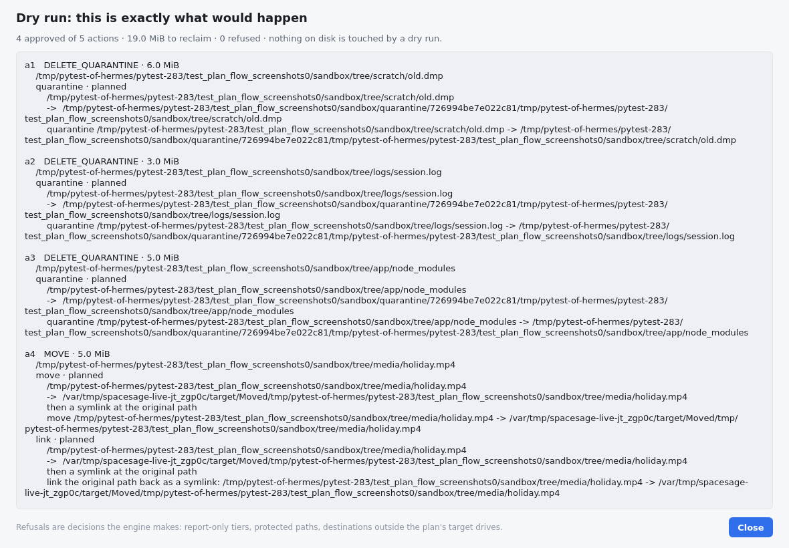

**Dry-run preview** resolves every approved action into the exact operation it
would perform — where the quarantine goes, where the move lands, which link
keeps the old path alive, and any refusal with its reason — and **touches
nothing**. Refusals are decisions the engine makes (report-only tiers, protected
paths, destinations outside the plan's target drives) and they are shown here so
that a plan cannot fail on something you could have seen first.

### Execute

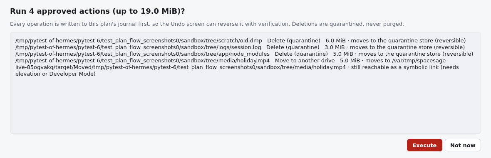

**Execute…** asks one itemized question — *"Run N approved actions (up to X)?"* —
listing every action with its size and what happens, behind a danger-styled
button. The dialog also states the two guarantees: every operation is journaled
first, and deletions are quarantined, never purged.

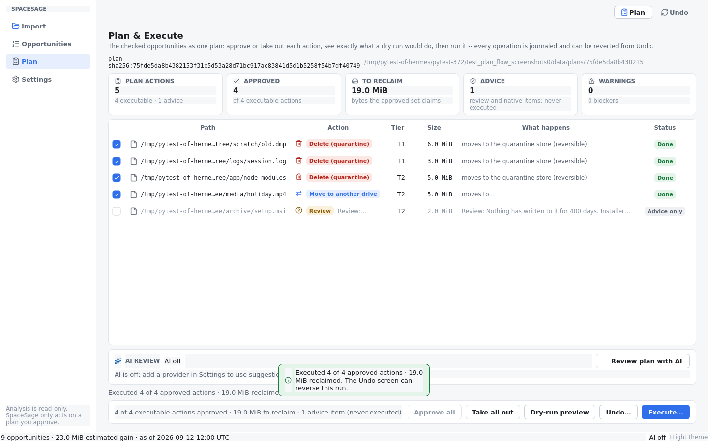

The run reports per item as it goes. Everything that failed, was refused or had
to be skipped is surfaced as a banner — a locked file is never yanked, and a
destination that filled up is a reported skip, not a silent hole. Per plan, per
action, the status is one of *Planned*, *Done*, *Skipped*, *Refused*, *Failed*.

---

## 5. Undo

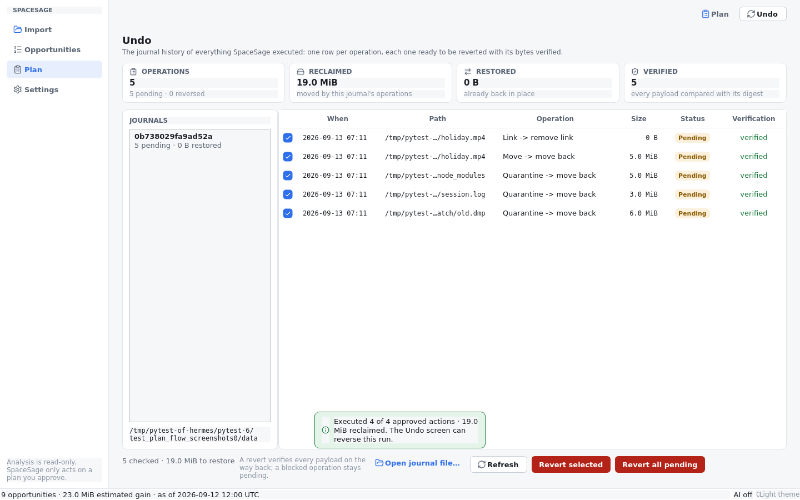

The switch beside *Plan* opens **Undo**. It lists this app's journals and, for
the selected one, one row per operation that was really performed: when, which
path, what the operation was (`Quarantine → move back`, `Move → move back`,
`Link → remove link`), the size, the status and the **verification**.

- Every payload was compared with the digest the journal recorded on the way in,
  so *verified* means the bytes match today, not that a copy was attempted.
- *Revert selected* / *Revert all pending* reverse operations in the only order
  that is safe: the **link before the move** that created it, the **move before
  the quarantine** it followed.
- An operation whose original path is occupied again is **blocked** and stays
  pending for the next run — it is never clobbered. One whose payload was purged
  by hand is reported as gone.
- Undo is itself journaled, so running it twice reports "nothing to undo"
  instead of moving things back and forth.

---

## 6. Settings

The Settings page has three sections.

- **Appearance** — *Follow the system* / *Light* / *Dark*. One token set drives
  both themes: spacing grid, typography scale, semantic colours, tier badges and
  the mono stack for paths and sizes.
- **AI** — the provider list, the policies and the cache (see above). The cache
  line names the folder and how many answers it holds; *Clear cache* empties it.
- **Index** — where the index lives, how big it is, and the data folder the app
  uses for its own files. The note under it is the contract: *"the index is the
  imported WizTree export. Re-importing replaces it; nothing on disk is touched
  by an analysis."*

---

## Where the app keeps its files

| what | where |
|---|---|
| Index (the imported export) | `<data dir>/spacesage.db` |
| Per-plan workspaces and `approved.json` | `<data dir>/plans/<plan token>/` |
| Journals (what Undo reads) | next to the plan's journal file, referenced by the plan workspace |
| Settings | the platform's config store (`QSettings`: registry on Windows, ini on Linux) |
| AI cache | `<data dir>/ai-cache` (or `SPACESAGE_AI_CACHE_DIR`) |

`<data dir>` is the per-user location (`%LOCALAPPDATA%\spacesage` on Windows,
`~/.local/share/spacesage` on Linux, `~/Library/Application Support/spacesage`
on macOS), and `SPACESAGE_DATA_DIR` overrides it — which is also how the test
suite and the packaging smoke run keep their hands off your real data.

The app never writes next to its own executable, so a portable build can sit
anywhere.
